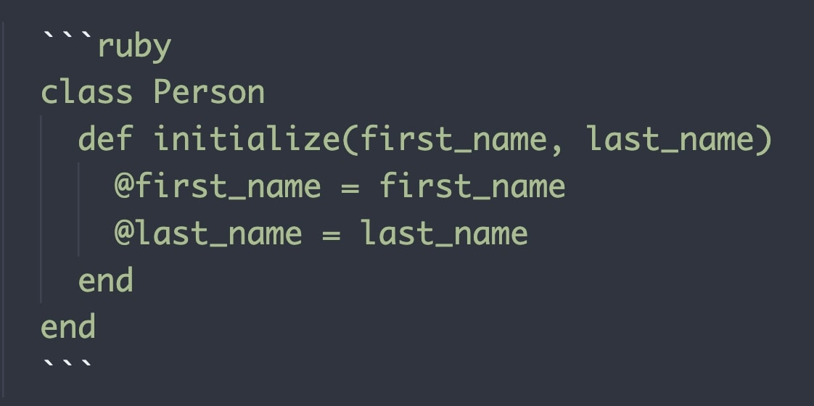

# Book syntax

Chapter content is in Markdown format but currently, not all elements from Markdown syntax are supported. The following elements are currently supported:

```markdown
# This is the chapter title
## This is the header h2
### This is the header h3
#### This is the header h4

This is simple paragraph with some additional formatting like **bold** or `code` text.
```

Here is the formatting of the above paragrahp: This is simple paragraph with some additional formatting like **bold** or `code` text.

## Formatting lists

You can use two types of lists. Ordered:

```markdown
1. The first element
2. The second element
3. The last element
```

The above code will result in:

1. The first element
2. The second element
3. The last element

You can also use unordered list:

```markdown
* The first element
* The second element
* The last element
```

The above code will result in:

* The first element
* The second element
* The last element

## Formatting code

You can format the snippet of code:



The above code will result in the following text:

```ruby
class Person
  def initialize(first_name, last_name)
    @first_name = first_name
    @last_name = last_name
  end
end
```

This time I used image as reference to not confuse parser with nested markdown syntax. Instead of `ruby` you can use any other language or technology like `javascript`, `html`, `css`, `yaml`, `sql`, etc.

## Images

Currently, only `jpg` images are supported as they are not problematic during the rendering process (and they are rendered fast). Please move all images to the `images` directory in the chapter directory. If you would use the following code in `introduction` chapter:

```markdown

```

The parser would look for `content/introduction/images/picture.jpg` file.

## Links

You can use standard syntax for links:

```markdown
[link name](http://address.com)
```

When you release the book (merge the code to the main branch), links are automatically replaced to the following format: `https://pushand.pub/r/{unique-token}` - this is the proxy URL that will redirect immediately to your link. In future updates for the platform, it will be possible to edit this link so even if the original link is no longer accessible, your past readers won't experience issues.
